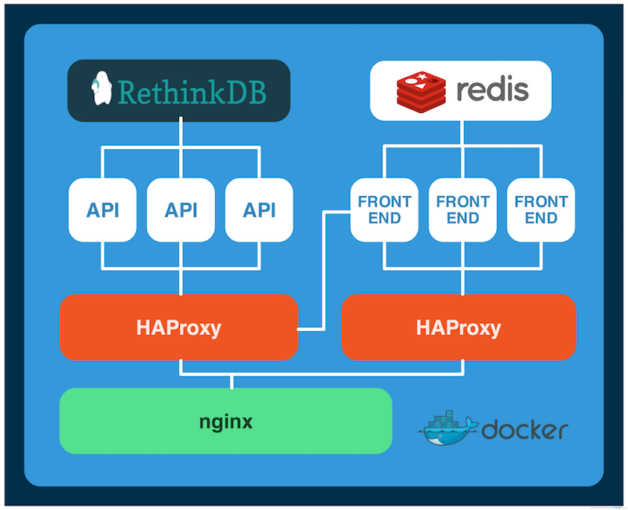

# Production Set-up

This is a Docker Compose app with all the services imported as submodules. It's configured for production usage.

## Features

- services
  - `frontend` and `api` are each behind a [HAProxy](http://www.haproxy.org/) reverse-proxy container
  - the HAProxy container includes cluster discovery so newly created containers are immediately picked up
  - scaling the services is very easy: `docker-compose scale api=3 frontend=2`
- main
  - the main reverse proxy is [nginx](http://nginx.org/)
  - HTTPS connections are enforced; HSTS is also turned on
  - secure SSL certificate: 2048-bit key encrypted with SHA256
  - extra measures for security
    - `X-Frame-Options SAMEORIGIN` – block frames
    - `X-Content-Type-Options nosniff` – disable content-type sniffing
    - `X-XSS-Protection "1; mode=block"` – force enable the browser XSS filter
  - Gzip and SPDY enabled for extra speed
  - Google's [PageSpeed](https://developers.google.com/speed/pagespeed/module/?hl=en) module baked in for even more speed and performance
- orchestration
  - services run inside containers using [Docker Engine](https://www.docker.com/docker-engine)
  - containers are managed with [Docker Compose](https://www.docker.com/docker-compose)
  - the cluster of servers is managed by [Docker Swarm](https://www.docker.com/docker-swarm)
  - the servers are on [Digital Ocean](https://www.digitalocean.com/) deployed with [Docker Machine](https://www.docker.com/docker-machine)
- average load time under 1 second: [frontend](http://tools.pingdom.com/fpt/#!/bRQSQU/https://fou.fashion/), [api](http://tools.pingdom.com/fpt/#!/c3WC5o/https://api.fou.fashion/)

## To-Do

- set up nginx to cache static pages

## Deployment

```bash
# Log in to tutum.co (used as our private registry)
$ docker login tutum.co

# Build the container images
$ docker build -t 'tutum.co/<user>/fouapi' api
$ docker build -t 'tutum.co/<user>/foufrontend' frontend
$ docker build -t 'tutum.co/<user>/founginx' nginx

# Push the images
$ docker push 'tutum.co/<user>/fouapi'
$ docker push 'tutum.co/<user>/foufrontend'
$ docker push 'tutum.co/<user>/founginx'

# Generate a discovery token
$ docker run --rm swarm create

# Deploy the master server on Digital Ocean
$ docker-machine create \
  --driver digitalocean \
  --digitalocean-access-token=$DO_TOKEN \
  --digitalocean-region=ams2 \
  --swarm \
  --swarm-master \
  --swarm-discovery token://$SWARM_TOKEN \
  fou-prod-00

# Deploy nodes
$ docker-machine create \
  --driver digitalocean \
  --digitalocean-access-token=$DO_TOKEN \
  --digitalocean-region=ams2 \
  --swarm \
  --swarm-discovery token://$SWARM_TOKEN \
  fou-prod-01

# Configure the docker cli to use the swarm
$ eval $(docker-machine env --swarm fou-prod-master)

# Start the app
$ docker-compose up -d
```

## Backend Diagram



## Domains

- `fou.fashion` – the frontend service
- `api.fou.fashion` – the root API endpoint
- `rethinkdb.fou.fashion` – RethinkDB dashboard (password protected)

## Extra

Also do these for your own sanity:

```bash
$ alias dk=docker
$ alias dc=docker-compose
$ alias ma=docker-machine
```
